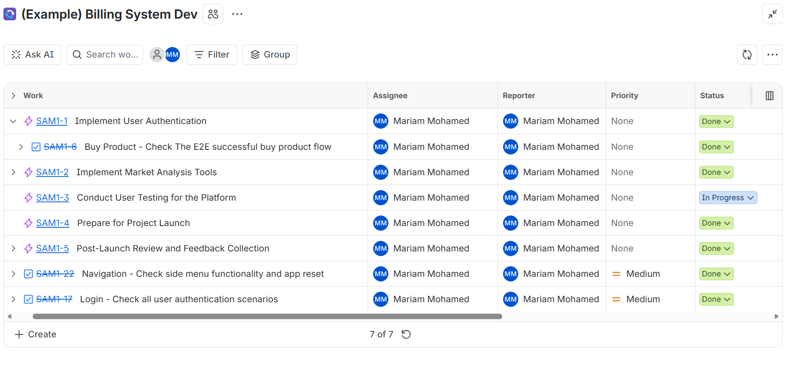
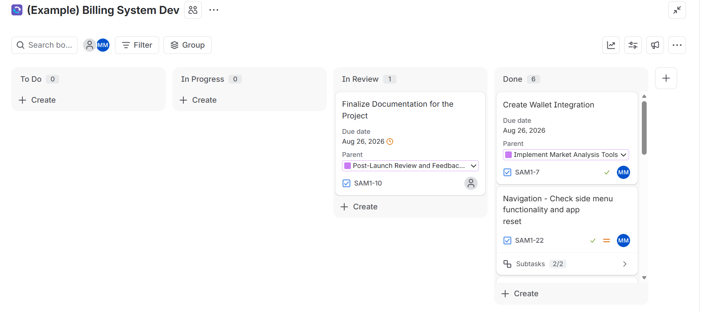
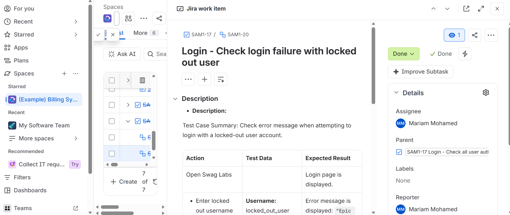
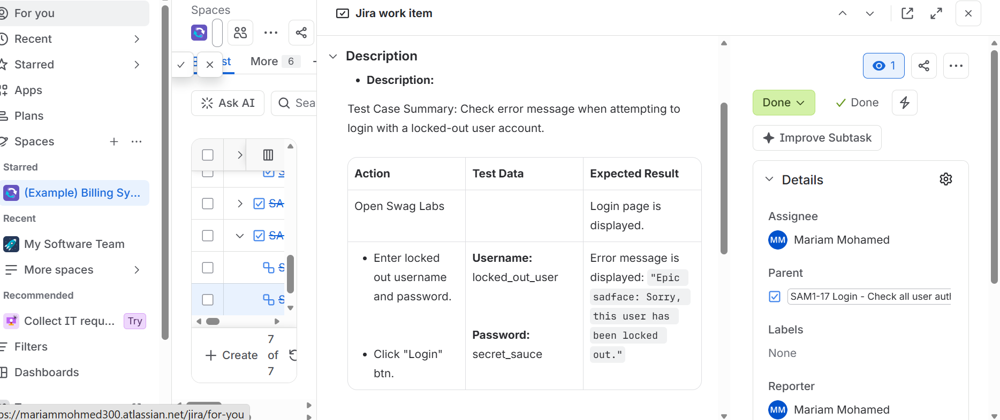
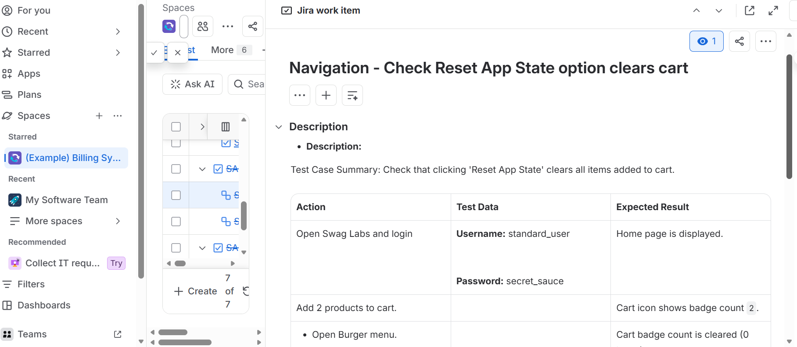
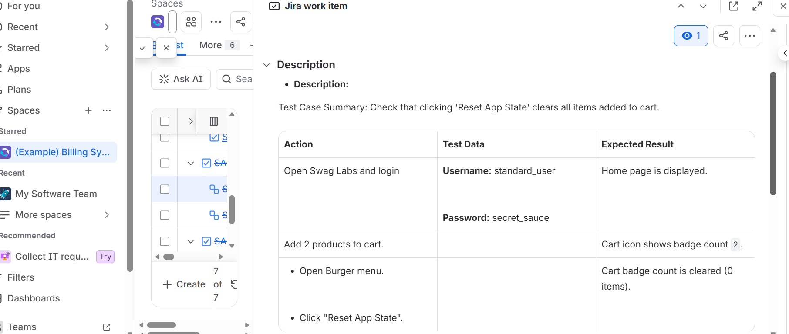

#  Swag Labs (SauceDemo) - Test Case Documentation & Jira Management

## 📌 Project Overview
Comprehensive Quality Assurance (QA) testing suite and Agile workflow execution for **Swag Labs** using **Atlassian Jira**. This repository showcases detailed manual test cases designed, organized, and managed directly within Jira Software, as well as the complete Excel test documentation.

---

##  Complete Test Case Suite (Excel Sheet)
A comprehensive Excel spreadsheet containing all structured Test Cases with Pre-conditions, Test Steps, Test Data, Expected Results, and Execution Status:

🔗 **[Download Complete Test Cases Excel Sheet](./SwagLabs_Test_Cases_Mariam.xlsx)**

---

##  Jira Management & Execution Evidence

###  1. Project Hierarchy (Tree View)
Displays the complete Epic, Tasks, and Sub-tasks hierarchy for full traceability.

---

###  2. Jira Board View
Displays the Agile board status showing all tasks moved across workflow states to **Done**.

---

###  3. Test Case Execution Details by Module

#### A. Module: E2E Buy Product Flow
*Detailed steps and expected results for validating product checkout scenarios.*

---

#### B. Module: User Authentication (Login)
*Detailed steps for valid login, locked-out users, and empty credentials.*

---

#### C. Module: Side Navigation & App State
*Detailed steps for testing side menu options like Reset App State and Logout.*

---

##  Tools & Methodologies
* **Jira Software:** Test Case Management, Agile Board Management, Sub-task Mapping
* **Documentation:** Excel Test Suites (Equivalence Partitioning & BVA)
* **Testing Scope:** End-to-End (E2E), Functional Validation, UI/UX Verification, Negative Scenarios

---

## 👤 Author
* **Mariam Mohamed** - Quality Assurance Engineer
